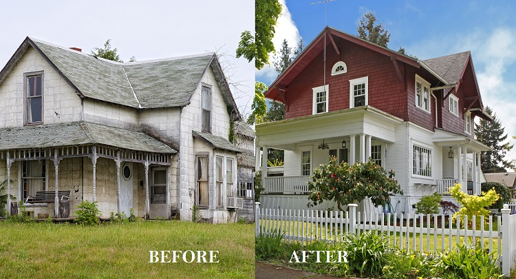
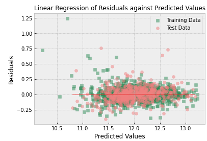
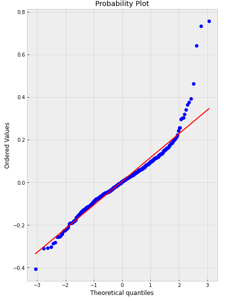
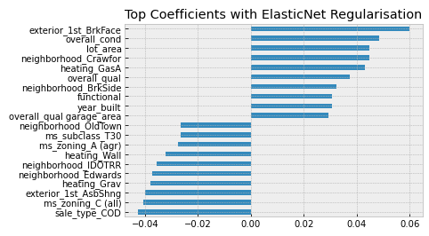

# Predicting House Price in Ames, Iowa with Linear Regression
#### Author: Tye Hang Feng

## Background

Ames is city in Central Iowa, we are a team of data analysts working for Livable.io a company in the House-flipping business for residential properties.

Livable.io typically uses the following process for our home flip projects:

1) Purchase properties that are undervalued.
2) Peform renovations/repairs on the property to maximise value
3) Once repairs/renovations are completed relist the property at a higher selling price.

Profit is generated from price gains from the sale of relisted properties. To increase profit per relisting, Livable.io has decided to leverage on data analytics to better predict sale prices of our existing portfolio of properties and identify future opportunities.

## Problem Statement

**Problem statement:** Our team's goal is to build a linear regression model that can predict the expected sale price of a property to:

1) Use the predictions generatd by the model as a comparison against prices requested by home sellers to determine if bids received are over/under valuation, 
2) determine how changes to various features of a house affects the sale price so that capital can be directed towards repairs/ renovations that generate the largest change in salesprice; and 
3) ascertain the expected sale price of a refurbised and relisted property.

Models will first be evaluated by R^2 score to determined if the model is sufficiently generalised and able to adequetly explain the variation in housing prices. Once the R^2 scores have been assessed models will be ranked based on the RMSLE produced by the models when used to predict the prices on a validation data set data set.

## Executive Summary

From the dataset containing data on home sales in Ames between 2006 to 2010, we have successfully created a ElasticNet model that has a R^2 score of 0.91 and RMSE of $20,268. 

Our model initially took in 539 features (inclusive of engineered, polynomial and dummy columns), eliminating 226 and keeping 313. Based on our model we recommend Livable.io to act on the following:

- Avoid homes located in undesierable neighborhoods (like Edwards) or zoning types (like zoning_All) as these homes typically sell for less.
- Aesthetic features like brick exteriors seem to have a positive impact on sale price, and replacing facades of future projects could generate additional profits
- Create a companion model that predicts the estimated cost of adding or removing such various features so that profitability of renovating specific features can be determined.

## Table of Contents

1) [Background](#Background)
2) [Problem Statement](#Problem-Statement)
3) [Executive Summary](#Executive-Summary)
4) [Data Dictionary](#Data-Dictionary)
5) [Model](#Model)
6) [Key Findings](#Key-Findings)
7) [Conclusions and Recommendations](#Conclusions-and-Recommendations)

## Data Dictionary

A link to the data dictionary can be found [here](http://jse.amstat.org/v19n3/decock/DataDocumentation.txt).

Additional features added as part of the data engineering progress is summarised as follows:

|Feature|Type|Type2|Description|
|:-|:-|:-|:-|
|overall_state|Int|Ordinal|Overal condition X quality of the property| 
|hse_sf|float|continuous|Combined sf of all parts of house|
|latest_remod|Int|discrete|year of latest remod (year built if no remods)| 
|age_from_latest_remod|Int|discrete |Age from last remod (year built if no remods|
|hse_age|Int|discrete |Age from year built|
|exter_state|Int|Ordinal |Exterior condition X quality of the property|
|bsmt_state|Int|Ordinal |Bsmt condition X quality of the property|
|bsmt_fin_area|float|continuous|total area of bsmt finished area|
|bsmtfin_type_combined|float|continuous|total area of bsmt finished area, weighted by finish type|
|total_bath|Int|discrete|total number of baths and half baths|
|kitchen|Int|discrete|number of kitchen X kitchen quality|
|fireplace|Int|discrete|number of fireplaces X fireplace quality|
|garage_state|Int|Ordinal|garage condition X quality X finish of the property|
|garage_age|Int|discrete |Age from garage year built|
|pool_state|float|continuous |Pool quality X pool area|

## Model

We segmented the training data into two sets, in approximately a 70 - 30 split with the larger set used to train the model and the second smaller set used to verify the accuracy of the model.

Of the 4 models employed, the ElasticNet was selected as the model performed well while also able to perform well while mostly maintaining normality in distribution of residuals.

A breakdown of the performance by model is as follows:

|Model   |R2 - Train   |R2 - Test   |RMSLE - Train   |RMSLE - Test   |
|---|---|---|---|---|
|Linear Regression   | 0.65  |-20.2   |0.236   |1.731   |
|Ridge Regression   |0.92   |0.911   |0.116   |0.116   |
|Lasso Regression   |0.917   |0.911   |0.117   |0.115   |
|ElasticNet   |0.92    |0.909   |0.116   |0.116   |

### Distribution of residuals of Selected Model

Plotting the residuals against the predicted values of the model we see that with the exception of some outliers, most residuals appear to be randomly spread out along the zero line.

We also observe this on the probability plot wehere we see that residuals apprear mostly normally distributed with with the exception of large positive residuals at the top which deviate from the line.

While the slight deviation from normality is not ideal, we can see that it only affects predictions for houses with extremly low prices and the model is expected to perform well for a large majority of houses.

## Key Findings

Regression coefficients general describes the size and direction of the relationship between the independent variable (the features) and target variable (sales price).

Of the features in our regression model, the feature 'exterior_1st_brkface' has the highest positive coeficient of 0.06 indicating that homes with brick face exteriors tend to sell for 6% higher than homes without. 

Other features such as overall_condition, lot_area and overall_qual had strong positive coeficients as well indicating that houses with higher quality, condition and size tend to sell at a premium compared to smaller houses in poor condition.

We also note that different neighborhoods and zoning types had different regression coeficients. Houses in less desierable neighborhoods/zoning types that had negative regression coeficients should be avoided as they generally bring down sale price. 

## Conclusion and Recommendations

We set out to create a linear regression model that could predict the sale prices of properties with the following uses in mind:

1) Serve as a comparison against bids submitted by home sellers to determined if bids received are over/under valuation, 
2) determine how changes to various features of a house affects the sale price so that capital can be directed towards repairs/ renovations that generate the largest change in salesprice; and 
3) ascertain the expected sale price of a refurbised and relisted property.

We will evaluate the performance of the model and our recommendations based on the results of the model in relation to each goal.

##### One

Our chosen model model has a R^2 score of 91.1\% and a RMSLE score of 0.11551. Based on these matrics we expect that the model is robust and is able to account for ~91\% of the variance in sale prices and that our predictions are within $20,000 of the actual sale price. 

Reviewing the residuals of this model also revealed that most errors can be attributed to our model overestimating sale prices of properties that we sold for ~\$13,000 - 15,000. Considering that such low sale prices are rare in the dataset we expect the model to make predictions with smaller errors for a large majoriy of future bids and will provide good basis to determine the profitablity of bids received.

##### Two

Our second goal was to determine how individual features would affect the sale price. Of the 540 features (79 original + created features + polynomial features + dummies) that we fed into the ElasticNet Model the model eliminated 226 features and by sorting the remaining features we can see that there are various features with relatively strong coeficients that we can act upon.

Broadly speaking we observe that there is a mix of features describing quality, condition, living area, neighbourhood and zoning and aesthetic features have a notable impact on housing prices.

We can separate the features into 2 buckets and employ different strategies to mitigate the effect of negative variables while leveraging on features that have a positive impact to increase potential sale price. 

For features that we can change during the renovation process, we could divert captital to features that had strong positive coeficient with sale price. For example, changing the exterior of a house to brick ('exterior_1st_BrkFace') is expected to increase sale price by 6\% (exp(0.06)-1) or swapping out heat_grav (gravity heating) is expected to increase prices by 3.9\%. Based on our findings we have propose the creation of a companion model that uses info on labor and material cost that can be used to estimate the expected cost of various changes to determine the profitablity of renovations and repairs.

For features that we cannot change like neighborhood or zoning types we could avoid purchasing houses or make smaller offers for homes in less desierable areas, and make higher offers in areas that have a positive coeficient with saleprice. For example, a home in Edwards has a coeficient of -0.03 and is expected to sell for 3\% lower by avoiding houses in Edwards we can reserve our funds for projects with better projected returns.

##### Three

Similar to point 1 we expect our model to be able to accurately sale price given its features. As our model has an error of 20,000, We propose to mitigate this by starting our listings at a premium of 20,000 above our model predictions, allowing us to maintain margins in the event that the model makes an under-estimate.

## Possible Improvements to the Model

The data was was collected between 2006 and 2010 and in the last 11 years external factors that we have not accouted for could affect our model predictions. For example, the effect of black swan events like covid in 2019 to 2021 has resulting in large increases of 11.5\% in home prices between Dec 2020 and Dec 2021 in comparison to the relatively muted gain 4\% annual gain between 2010 to [2019](#https://www.cnbc.com/2021/09/03/asia-pacific-property-bidding-wars-cash-offers-drive-up-home-prices.html) 

In addition, trends in architectural preferences can fluctuate with time and our model will need constantly updated to ensure the coeficient of regression for various features truely reflect current preferences.